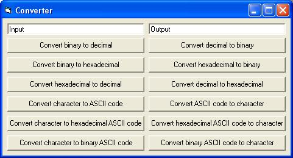



## A Converter for Binary, ASCII, Hex and Decimal

### Description

This code can convert to and from ASCII codes, decimal, hexadecimal, and binary.
 
### More Info
 
WAIT...

I didn't make all of this code!

I gathered some codes to learn myself, and to practice I made this little program.

             |
---                |---
**Submitted On**   |2003-07-16 06:38:02
**By**             |[Jeroen van de Ven](https://github.com/Planet-Source-Code/PSCIndex/blob/master/ByAuthor/jeroen-van-de-ven.md)
**Level**          |Advanced
**User Rating**    |4.2 (42 globes from 10 users)
**Compatibility**  |VB 3\.0, VB 4\.0 \(16\-bit\), VB 4\.0 \(32\-bit\), VB 5\.0, VB 6\.0, VB Script, ASP \(Active Server Pages\) , VBA MS Access, VBA MS Excel
**Category**       |[Miscellaneous](https://github.com/Planet-Source-Code/PSCIndex/blob/master/ByCategory/miscellaneous__1-1.md)
**World**          |[Visual Basic](https://github.com/Planet-Source-Code/PSCIndex/blob/master/ByWorld/visual-basic.md)
**Archive File**   |[A\_Converte1615587162003\.zip](https://github.com/Planet-Source-Code/jeroen-van-de-ven-a-converter-for-binary-ascii-hex-and-decimal__1-46954/archive/master.zip)

